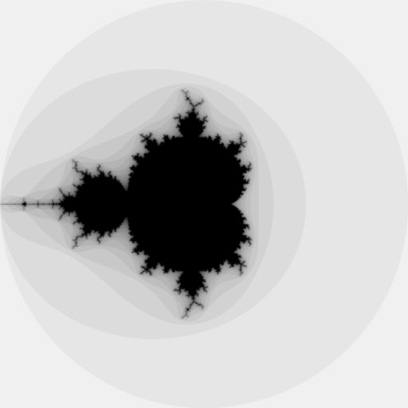

# Manderlang

A simple parallel program written in Erlang that draws the Mandelbrot fractal. 

This is my first program in Erlang; drawing the Mandelbrot set is didactically very interesting (recursion, binary data, writing to file, parallelism etc... are some of the problems that are involved), so... here we are! 
